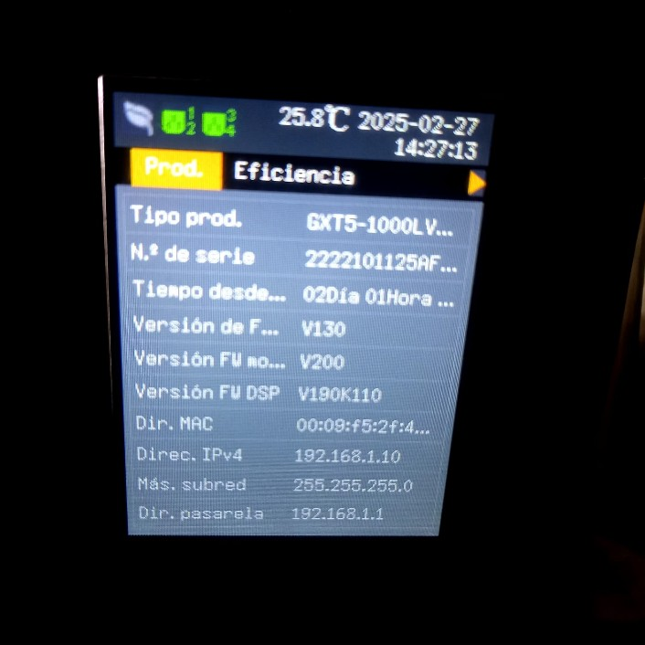
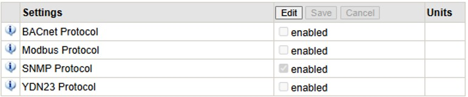
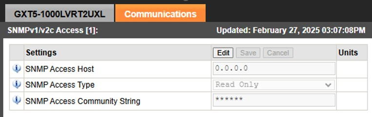
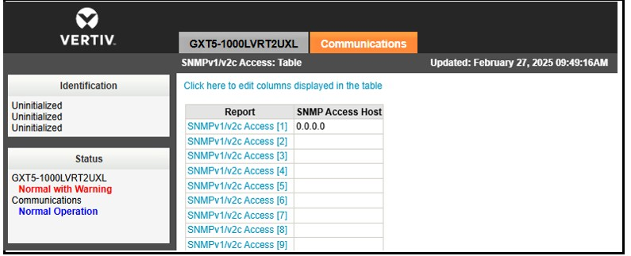

<h1 align="center"> Sistema Control Remoto UPS Liebert GXT5 On Line 3000 VA 208 VAC Escáneres Rayos X Terminal de Carga Aeropuerto el Dorado </h1>

  
El presente proyecto presenta un sistema remoto de monitoreo de infraestructura crítica que permite obtener datos de los parámetros de funcionamiento de las Unidades de Potencia Ininterrumpida (UPS). Este sistema facilita la supervisión en tiempo real de variables que permitien una gestión eficiente y preventiva del sistema eléctrico. La solución se basa en la integración de comunicación remota mediante protocolos industriales, almacenamiento estructurado de datos y visualización a través de dashboards interactivos, optimizando la toma de decisiones y el mantenimiento de los equipos.

El diseño del sistema se realiza mediante tecnologías IoT, realizando un programa en Node-Red que permite la comunicación con las UPS mediante el protocolo SNMP; Este sistema facilita la supervisión en tiempo real del estado de operación, temperatura, voltajes, niveles de carga, alarmas y eventos de las unidades, optimizando la gestión y mantenimiento preventivo del sistema de alimentación ininterrumpida.
Adicionalmente, se implementa un dashboard visual e interactivo que permite centralizar la información de varias UPS de diversos fabricantes para generar alertas ante condiciones anormales de funcionamiento.

**Tecnologías Utilizadas**

* Arquitectura IoT (adquisición → red → procesamiento → visualización)
* Node-RED – Plataforma de integración para soluciones IoT
* Dashboards de Node-RED – Interfaz de visualización IoT
* JavaScript – Lógica y procesamiento de datos
* JSON – Formato de intercambio de información
* Protocolo SNMP – Telemetría y monitoreo remoto de dispositivos IoT

**Infraestructura**

* UPS Liebert GXT5 On-Line UPS 3000VA 208V AC
  
<table>
  <tr>
    <td>
      Los sistemas de alimentación ininterrumpida (UPS) son dispositivos que mediantes elementos almacenadores de energía, durante un apagón eléctrico proporcionan energía eléctrica por un tiempo limitado        a        los dispositivos que tenga conectados, corrige fallos relacionados con <b>alimentación, variaciones en las frecuencias, picos de corriente y sobretensiones.<b/>   
    </td>
    <td>
      
    </td>
  </tr>
</table>

* Módulo IntelliSlot RDU 101
  
<table>
  <tr>
    <td>
      El módulo IntelliSlot es una tarjeta de expansión utilizada en muchos modelos de UPS, incluyendo las de la serie GXT5 de APC, para facilitar la comunicación con sistemas de monitoreo y control. IntelliSlot          permite a la UPS interactuar con redes a través de diferentes protocolos como SNMP, Modbus, y otros, permitiendo un monitoreo remoto eficiente.  <b/>   
    </td>
    <td>
      
    </td>
  </tr>
</table>

* Node-RED
  
<table>
  <tr>
    <td>
      Node-Red es una plataforma de desarrollo basada en flujos que permite integrar, procesar y visualizar datos provenientes de diferentes dispositivos y protocolos. En un sistema de monitoreo por SNMP, Node-Red        actúa como un orquestador que consulta periódicamente los equipos mediante OIDs, recibe sus valores en tiempo real y los transforma en información útil para el seguimiento del estado, desempeño y alarmas de         la infraestructura monitoreada.  <b/>   
    </td>
    <td>
      
    </td>
  </tr>
</table>

**Comunicación Power Insight - Servidor Local**

Se realiza la instalación del módulo de comunicación de la UPS. Toda la línea VERTIV cuenta con un puerto dedicado para este módulo en el panel posterior de la unidad, tal como se observa en la imagen.

Una vez instalado el módulo, se conecta el puerto LAN Ethernet, el cual asigna una dirección IPv4 192.168.1.10. Esta dirección puede visualizarse en el panel de la UPS y permite acceder al software de gestión del módulo.

Vertiv™ Power Insight es una plataforma web diseñada para usuarios con infraestructuras distribuidas que necesitan gestionar múltiples dispositivos. Es fácil de instalar y utilizar gracias a su interfaz centralizada, que permite administrar hasta 100 UPS desde un único entorno. Se ingresan las siguientes credenciales:

Username: **Master**

Password: **Liebertonline25**

<table>
    <tr>
        <td>
           
        </td>
        <td>
          
        </td>
    </tr>
</table>

En Power Insight se usa la siguiente  ruta de acceso a las configuraciones para ajustar el protocolo de comunicación SNMP.

**Communications / Protocols / SNMP / SNMPv1 v2c Access**

El host de acceso se deja de manera pública y la contraseña definida como “public”. A partir de la configuración del protocolo SNMP  se realiza el escalamiento y extracción de información en Node- Red para visualizar los datos de monitoreo de la UPS en tiempo real y poder diseñar el sistema con diferentes marcas teniendo en cuenta la variación de las direcciones IP proporcionadas por el servidor.

<table>
    <tr>
        <td>
           
        </td>
        <td>
          
        </td>
    </tr>
</table>

Este procedimiento se aplica igualmente a una UPS American Power, con el fin de comprobar que el diseño del sistema de monitoreo es compatible con equipos de distintos fabricantes. La integración se realiza de la misma manera, utilizando el protocolo SNMP mediante la conexión entre la UPS y su módulo de comunicación específico del fabricante, garantizando así la captura de variables operativas y el correcto funcionamiento del monitoreo en Node-RED.

**Instalación Node-RED**

Se realiza la instalación de Node-RED, accediendo desde el símbolo del sistema. y se ejecuta en el navegador como localhost:1880 para construir el diagrama de flujo del sistema de monitoreo. Para el desarrollo del diagrama de flujo del sistema de monitoreo se instalan las siguientes librerías.

* node-red-node-snmp
* node-red-node-ping
* node-red-node-email
* node-red-dashboard

**Construcción Diagrama de Flujo Node-RED**

* **Nodo INJECT**
  
  Se realiza la configuración del nodo Inject para definir la latencia del sistema, en este caso se realiza monitoreo de las variables de la UPS cada 5 segundos. La configuración se observa en la siguiente Figura.

* **Nodo SNMP**

  Se realiza la configuración de este nodo insertando la dirección IP del host , la versión del Protocolo y el OID  respectivo de la variable a monitorear.

* **Idenitificación  OIDs**

  Se han identificado y probado los OIDs (Object Identifiers) necesarios para extraer datos como voltaje, capacidad de batería y estado operativo.

  1.3.6.1.2.1.33.1.2.2.0 - Duración de la batería del UPS, en segundos.
  
  1.3.6.1.2.1.33.1.2.3.0 - Tiempo hasta que las baterías se agoten cuando se corta la alimentación, en minutos
  
  1.3.6.1.2.1.33.1.2.4.0 - Carga restante de la batería, porcentaje
  
  1.3.6.1.2.1.33.1.2.5.0 - Voltaje actual de la batería, en décimas de voltios
  
  1.3.6.1.2.1.33.1.2.6.0 - Corriente actual de la batería, en décimas de amperios
  
  1.3.6.1.2.1.33.1.2.7.0 - Temperatura del UPS , en grados Celsius

 **Desarrollo Dashboard**
 
Se llevó a cabo el diseño y construcción del dashboard para la visualización en tiempo real de las variables monitoreadas. El dashboard permite segmentar y organizar la información correspondiente a cada una de las UPS conectadas al sistema, facilitando la identificación del estado operativo, condiciones de carga, alarmas y demás parámetros críticos de cada equipo. Cada uno de los datos proporcionados se procesan para visualizar en tiempo real cada una de las metricas de las UPS.

 **Sistema de Alerta**

 

