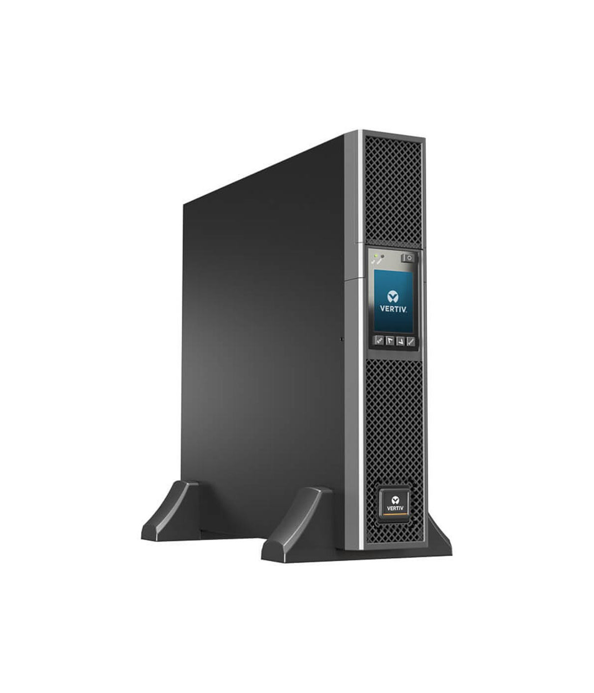
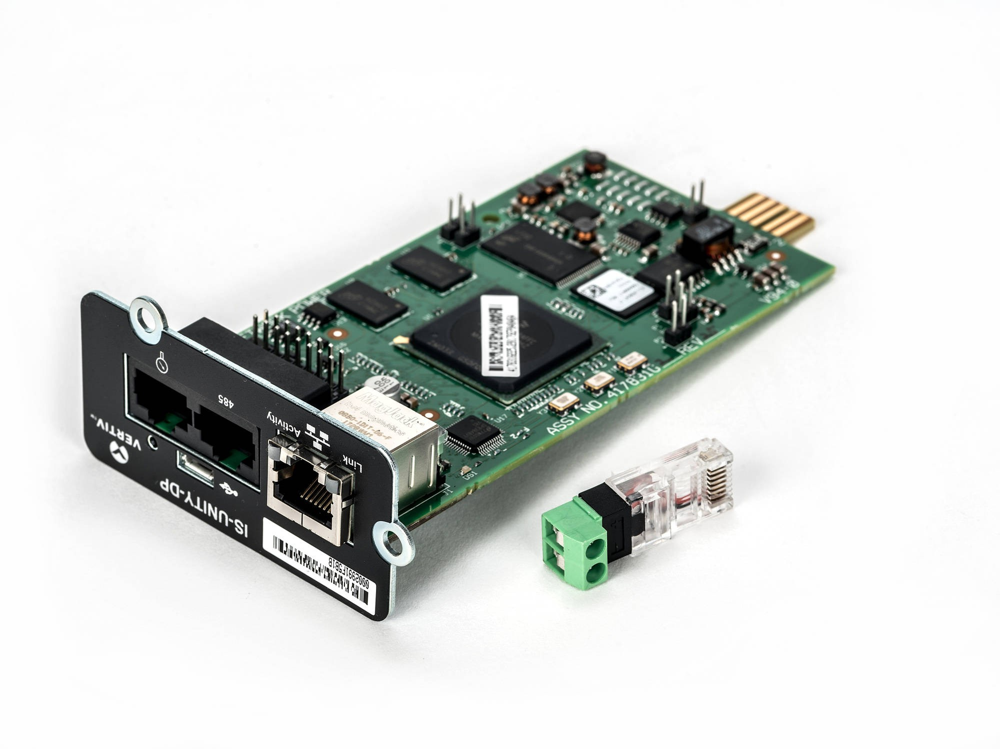
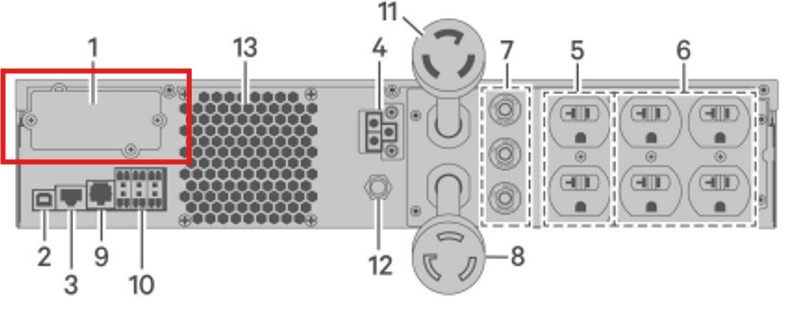
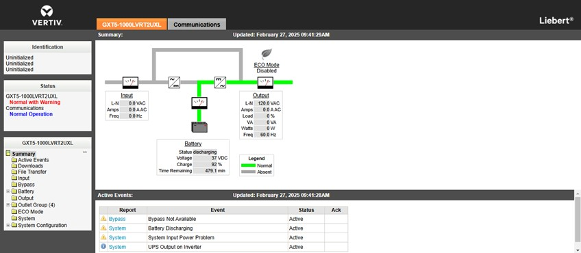

<h1 align="center"> Sistema Control Remoto UPS Liebert GXT5 On Line 3000 VA 208 VAC Escáneres Rayos X Terminal de Carga Aeropuerto el Dorado </h1>

  
El presente proyecto presenta un sistema remoto de monitoreo de infraestructura crítica que permite obtener datos de los parámetros de funcionamiento de las Unidades de Potencia Ininterrumpida (UPS). Este sistema facilita la supervisión en tiempo real de variables que permitien una gestión eficiente y preventiva del sistema eléctrico. La solución se basa en la integración de comunicación remota mediante protocolos industriales, almacenamiento estructurado de datos y visualización a través de dashboards interactivos, optimizando la toma de decisiones y el mantenimiento de los equipos.

El diseño del sistema se realiza mediante tecnologías IoT, realizando un programa en Node-Red que permite la comunicación con las UPS mediante el protocolo SNMP; Este sistema facilita la supervisión en tiempo real del estado de operación, temperatura, voltajes, niveles de carga, alarmas y eventos de las unidades, optimizando la gestión y mantenimiento preventivo del sistema de alimentación ininterrumpida.
Adicionalmente, se implementa un dashboard visual e interactivo que permite centralizar la información y generar alertas ante condiciones anormales de funcionamiento.

**Tecnologías Utilizadas**

* Arquitectura IoT (adquisición → red → procesamiento → visualización)
* Node-RED – Plataforma de integración para soluciones IoT
* Dashboards de Node-RED – Interfaz de visualización IoT
* JavaScript – Lógica y procesamiento de datos
* JSON – Formato de intercambio de información
* Protocolo SNMP – Telemetría y monitoreo remoto de dispositivos IoT

**Infraestructura**

* UPS Liebert GXT5 On-Line UPS 3000VA 208V AC
  
<table>
  <tr>
    <td>
      Los sistemas de alimentación ininterrumpida (UPS) son dispositivos que mediantes elementos almacenadores de energía, durante un apagón eléctrico proporcionan energía eléctrica por un tiempo limitado        a los dispositivos que tenga conectados, corrige fallos relacionados con <b>alimentación, variaciones en las frecuencias, picos de corriente y sobretensiones.<b/>   
    </td>
    <td>
      
    </td>
  </tr>
</table>

* Módulo IntelliSlot RDU 101
  
<table>
  <tr>
    <td>
      El módulo IntelliSlot es una tarjeta de expansión utilizada en muchos modelos de UPS, incluyendo las de la serie GXT5 de APC, para facilitar la comunicación con sistemas de monitoreo y control. IntelliSlot permite a la UPS interactuar con redes a través de diferentes protocolos como SNMP, Modbus, y otros, permitiendo un monitoreo remoto eficiente.  <b/>   
    </td>
    <td>
      
    </td>
  </tr>
</table>

**Procedimiento**

Se realiza la instalación del módulo de comunicación de la UPS. Toda la línea VERTIV cuenta con un puerto dedicado para este módulo en el panel posterior de la unidad, tal como se observa en la imagen.

<h1 align="center"> 
  
</h1>

Se conecta el puerto LAN Ethernet el cual asigna una dirección IP que se visualiza en el panel de la UPS y que va a permitir acceder al software del módulo. El Vertiv™ Power Insight es un software web diseñado para los usuarios con infraestructuras distribuidas que necesitan gestionar múltiples dispositivos. Es fácil de instalar y de utilizar gracias a una interfaz única para hasta 100 UPS.

<h1 align="center"> 
  
</h1>

